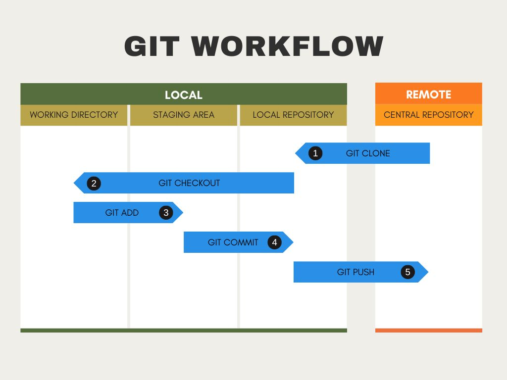
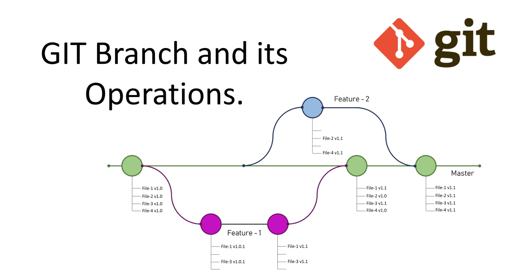

# Algunos Conceptos

Un **Repositorio** es un directorio que contiene todos los archivos y carpetas de un proyecto, y en Git también el historial de cambios. Lo podemos tener en local o en un servidor remoto. Cuando **Clonas** un repositorio, te estás descargando la imagen del repositorio en ese momento y también toda la historia de cambios desde el inicio del repositorio.

Un **Commit** es una foto del estado del repositorio, de los cambios que se han hecho respecto de la foto (commit) anterior.

**Push** es enviar tus cambios, tus commits, al repositorio remoto y **Pull** es lo contrario, "tirar" o descargarte los cambios del repositorio remoto.

Una **Rama** (*branch*) es una línea de desarrollo independiente. Normalmente tendremos una rama principal, que se suele llamar *main* o *master* y otras ramas para trabajar en nuevas características, corrección de errores, etc., sin que se vea afectada la rama principal.

**Merge** Es el proceso de combinar 2 ramas, por ejemplo, una vez que has terminado una característica nueva puedes fusionar la rama en la que hacías el desarrollo con la rama principal.

En un entorno de desarrollo suele estructurarse.

[Volver](../README.md)
